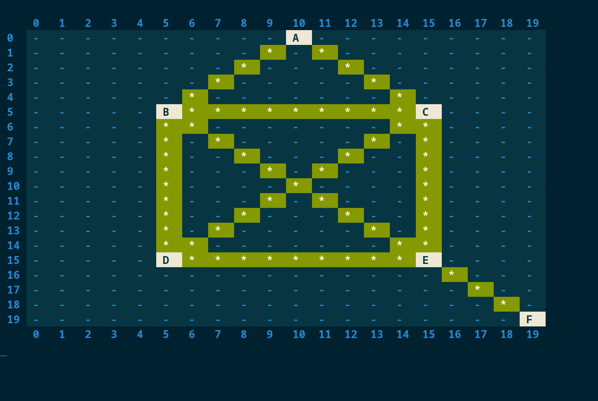

# Eulerian Path

Educational code.

[Article/analysis: blog.codeasap.pl](https://blog.codeasap.pl/posts/graphs/eulerian-path/).

## Implementations:

+ Python
+ PostgreSQL (PL/pgSQL)

## Visualization




## Run: Python

Help:

```text
$ python python/eulerian_path.py --help
usage: eulerian_path.py [-h] [-i] [file]

positional arguments:
  file

optional arguments:
  -h, --help         show this help message and exit
  -i, --interactive
```

Run:
```text
$ python python/eulerian_path.py -i
```

## Run: PostgreSQL

Run:
```shell
$ cd pgsql && sh run.sh && cd -
```

## Information

PL/pgSQL has [several variants](pgsql/variants).
Recursive CTEs debugging help can be found in [pgsql/help](pgsql/help).


## BUGS

Always.
